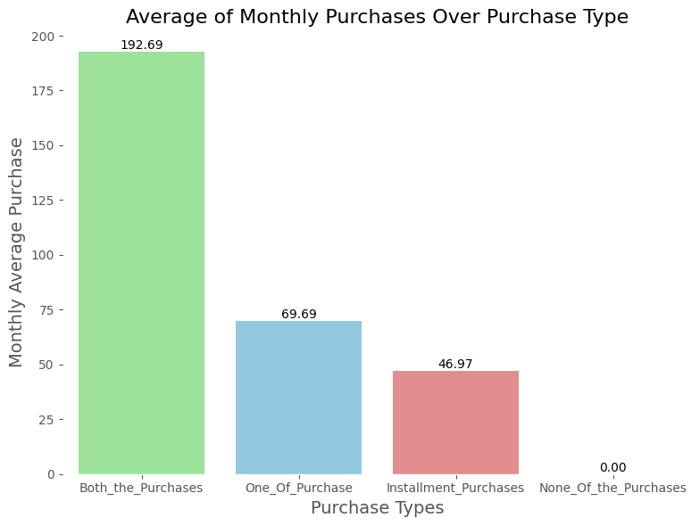

# Credit Card Behavior: A Data-Driven Insight into Customer Spending


## Context

Delimiting credit card spending behavior is a common challenge in the financial industry. This task involves analyzing multiple aspects of credit card usage, such as balance, purchases, cash advances, credit limits, and total payments. Although credit card usage may seem random at first glance, there are patterns that can help infer and trace behavioral profiles based on these variables.

## Feature description

This study is based on a real-world dataset containing information from 9,000 credit card accounts that have been active in the last six months at a financial institution. The dataset includes 18 behavioral variables related to card usage. The marketing team aims to apply different marketing strategies tailored to specific customer groups.

#### Features

- **CUST_ID**: Unique identifier for each credit card holder.
- **BALANCE**: Monthly average balance (calculated based on daily balance averages).
- **BALANCE_FREQUENCY**: Ratio of months in the last year with a balance.
- **PURCHASES**: Total purchase amount spent over the last 12 months.
- **ONEOFF_PURCHASES**: Total amount spent on one-off purchases.
- **INSTALLMENTS_PURCHASES**: Total amount spent on installment purchases.
- **CASH_ADVANCE**: Total cash advance amount taken by the customer.
- **PURCHASES_FREQUENCY**: Frequency of purchases (percentage of months with at least one purchase).
- **ONEOFF_PURCHASES_FREQUENCY**: Frequency of one-off purchases over the period.
- **PURCHASES_INSTALLMENTS_FREQUENCY**: Frequency of installment purchases.
- **CASH_ADVANCE_FREQUENCY**: Frequency of cash advances.
- **AVERAGE_PURCHASE_TRX**: Average amount per purchase transaction.
- **CASH_ADVANCE_TRX**: Average amount per cash advance transaction.
- **PURCHASES_TRX**: Number of purchase transactions.
- **CREDIT_LIMIT**: Maximum credit limit for the cardholder.
- **PAYMENTS**: Total amount paid by the customer to reduce their balance during the period.
- **MINIMUM_PAYMENTS**: Total minimum payments required over the period.
- **PRC_FULL_PAYMENT**: Percentage of months where the customer fully paid off the balance.
- **TENURE**: Number of months the customer has held the credit card.

## Objectives
The goal of this analysis is to derive meaningful insights from customer behavior data by creating new Key Performance Indicators (KPIs) and clustering clients based on their behavior. This will enable the marketing team to design targeted strategies for different customer segments. 

Our key objectives are:
- Construct enhanced customer behavior profiles by deriving new KPIs from the existing variables.
- Cluster customers into distinct behavioral segments based on their credit card usage patterns.
- Identify key characteristics of each cluster using detailed behavioral profiles.
- Provide strategic recommendations for targeted marketing based on the clustering results.

## Project outline
This project will cover the following key techniques:
- **Data exploration and preprocessing**: Initial analysis and cleaning of the dataset.
- **Handling missing data**: Managing incomplete information effectively.
- **Outlier detection and treatment**: Identifying and mitigating outliers that could skew results.
- **KPI construction**: Developing new metrics to better capture customer behaviors.
- **Clustering model construction**: Grouping clients based on similar usage patterns using clustering algorithms.
- **Model evaluation**: Assessing the quality and effectiveness of the clustering model.

## Exploratory Data Analysis (EDA)
### Dealing with Missing Values

Upon analyzing the missing data, we found that 3.5% of the values are missing in the **Minimum Payment** column, while the **Credit Limit** column has only one missing value (0.011%). Since the missing value in the **Credit Limit** column is isolated, it is more efficient to drop this single entry.


| Column Name                          | Percent of Missing Values | Count of Missing Values |
|--------------------------------------|---------------------------|--------------------------|
| BALANCE                              | 0.000                     | 0                        |
| BALANCE_FREQUENCY                    | 0.000                     | 0                        |
| PURCHASES                            | 0.000                     | 0                        |
| ONEOFF_PURCHASES                     | 0.000                     | 0                        |
| INSTALLMENTS_PURCHASES               | 0.000                     | 0                        |
| CASH_ADVANCE                         | 0.000                     | 0                        |
| PURCHASES_FREQUENCY                  | 0.000                     | 0                        |
| ONEOFF_PURCHASES_FREQUENCY           | 0.000                     | 0                        |
| PURCHASES_INSTALLMENTS_FREQUENCY     | 0.000                     | 0                        |
| CASH_ADVANCE_FREQUENCY               | 0.000                     | 0                        |
| CASH_ADVANCE_TRX                     | 0.000                     | 0                        |
| PURCHASES_TRX                        | 0.000                     | 0                        |
| CREDIT_LIMIT                         | 0.011                     | 1                        |
| PAYMENTS                             | 0.000                     | 0                        |
| MINIMUM_PAYMENTS                     | 3.497                     | 313                      |
| PRC_FULL_PAYMENT                     | 0.000                     | 0                        |
| TENURE                               | 0.000                     | 0                        |


For the **Minimum Payment** column, the distribution is highly skewed to the left, with a high concentration of values around the median. Given this skewness and **without having context of why this data is missing** imputing the missing values with the median is a practical and parsimonious solution.


### Treating outliers


We observe from the boxplots above that outliers are indeed present across several features. Addressing these outliers is crucial for maintaining the integrity of our analysis and improving model performance.

To address outliers in the dataset, I propose applying the **Interquartile Range (IQR) Method** for the following reasons:

**1. Robustness:** The IQR method focuses on the middle 50% of the data (between the 1st and 3rd quartiles). This makes it **less sensitive to extreme values** compared to methods that rely on the mean and standard deviation. By using this method, we are better able to detect genuine patterns in the data without being skewed by outliers.

**2. Efficiency:** The IQR method is **straightforward and computationally efficient**, allowing us to easily identify and remove or cap outliers. It involves calculating the range between the 25th percentile (Q1) and the 75th percentile (Q3), and then flagging any values that fall below Q1 - 1.5 * IQR or above Q3 + 1.5 * IQR as outliers.

**3. Broad Applicability:** This approach works well for a wide range of data distributions, including those with **skewness**, which is common in our dataset. The IQR method is non-parametric, meaning it does not assume a specific distribution, making it widely applicable.

## Understanding customer behaviour profiles via Key Performance Indicators (KPI's)

#### **Monthly Average Purchase**

Measures the average amount spent by a customer on purchases each month. It is calculated by dividing the total purchases made by the customer (`PURCHASES`) by the total tenure of the customer relationship in months (`TENURE`).

##### Interpretation
- **Customer Spending Behavior**: This KPI provides insights into the spending behavior of customers. A higher value indicates that customers are spending more on average each month.

#### **Monthly Average Cash Advance Amount**
Measures the average amount of cash withdrawn by a customer each month. It is calculated by dividing the total cash advances made by the customer (`CASH_ADVANCE`) by the total tenure of the customer relationship in months (`TENURE`).

##### Interpretation
- **Customer Cash Withdrawal Behavior**: This KPI provides insights into how often and how much customers are utilizing cash advances. A higher average indicates that customers are relying more on cash advances, which may reflect their financial needs or spending behavior.

##### Division of Customer By Type of Purchases

These categories were created to classify customers based on their purchasing behavior. By separating them into distinct types (no purchases, one-off only, installment only, or both), one can analyze trends and target marketing or customer retention strategies based on how individuals prefer to make purchases.

**Types of Purchase Categories**

1. **None_Of_the_Purchases**:
   - **Condition**: `(df['ONEOFF_PURCHASES'] == 0) & (df['INSTALLMENTS_PURCHASES'] == 0)`
   - **Explanation**: This category represents customers who made neither one-off purchases nor installment purchases.

2. **One_Of_Purchase**:
   - **Condition**: `(df['ONEOFF_PURCHASES'] > 0) & (df['INSTALLMENTS_PURCHASES'] == 0)`
   - **Explanation**: This category includes customers who made only one-off purchases but no installment purchases.

3. **Installment_Purchases**:
   - **Condition**: `(df['ONEOFF_PURCHASES'] == 0) & (df['INSTALLMENTS_PURCHASES'] > 0)`
   - **Explanation**: This category represents customers who only made installment purchases without any one-off purchases.

4. **Both_the_Purchases**:
   - **Condition**: `(df['ONEOFF_PURCHASES'] > 0) & (df['INSTALLMENTS_PURCHASES'] > 0)`
   - **Explanation**: This category represents customers who made both one-off and installment purchases.


Approximately 31% of customers engage in both one-off and installment purchases, while 25.3% exclusively make installment purchases

##### Estimating the limit usage of customers 

- **Formula**: `df['Limit_Usage'] = df['BALANCE'] / df['CREDIT_LIMIT']`
  
- **Explanation**: 
   - This variable represents the proportion of the available credit that a customer has utilized. It is calculated by dividing the current balance (`BALANCE`) by the total credit limit (`CREDIT_LIMIT`).
   - A higher value indicates that a customer is using a larger portion of their credit, which may suggest higher financial activity or potential risk in terms of credit management.
   - On the other hand, a lower value indicates that the customer is using less of their credit limit, which might suggest financial stability or less reliance on credit.

##### Interpretation 

- **Credit Utilization**: The `Limit_Usage` variable helps in understanding credit utilization, a critical factor in financial analysis and risk assessment.
- **Behavior Insight**: It allows us to gauge how much of their credit line customers are using. This feature can be useful in segmentation and clustering analysis to group customers based on their credit usage behavior.

##### Payment to Minimum Payments Ratio

- **Formula**: `df['Pay_to_MinimumPay'] = df['PAYMENTS'] / df['MINIMUM_PAYMENTS']`
  
- **Explanation**: 
   - This variable represents the ratio of the total payments made by a customer (`PAYMENTS`) to the minimum payments required (`MINIMUM_PAYMENTS`). 
   - A value greater than 1 means the customer is paying more than the minimum, indicating strong financial discipline and a desire to reduce their outstanding balance faster.
   - A value equal to 1 means the customer is paying exactly the minimum, which is meeting the requirements but not reducing the balance significantly.
   - A value less than 1 indicates that the customer is paying less than the minimum, which could signal financial difficulties or delinquency.

##### Interpretation?
- **Payment Behavior Insight**: The `Pay_to_MinimumPay` variable helps assess a customer's payment behavior, offering insights into their creditworthiness and financial responsibility.
- **Risk Assessment**: This feature is crucial for risk profiling and can be useful in identifying customers who may be at risk of default if they consistently pay less than the minimum required.

##### Minimun Pay per Purchase Type

We can assess how minimum payments are related to each purchase type:


##### **Insights**

- **Highest Payments in Installment Purchases**:  
  Customers who make installment purchases show the highest average payments relative to their minimum payments, with a ratio of 13.93. This indicates that customers in this group tend to pay significantly more than the required minimum, which might reflect a preference for long-term payment strategies with larger financial commitments.

- **Moderate Payments in 'None' and 'Both' Purchase Types**:  
  Both "None_Of_the_Purchases" and "Both_the_Purchases" groups have moderate payments above the minimum, with ratios of 10.46 and 7.31, respectively. These customers likely manage their payments in a more balanced way, avoiding both extremes of paying too little or too much beyond the minimum.

- **Lowest Payments in One-Off Purchases**:  
  The "One_Of_Purchase" group shows the lowest average payments relative to the minimum, with a ratio of 5.74. This suggests that customers making one-off purchases are more likely to pay closer to the minimum amount, which could indicate a more cautious approach to credit use, or possibly more conservative financial behavior.

- **Variance in Installment Purchases**:  
  The high average for installment purchases, coupled with significant variability, could indicate the presence of outliers or individuals who make large payments beyond the minimum. This may point to a smaller group of financially aggressive payers or require further investigation to assess whether such high payments are common in this group.

##### Credit Limit Balance per Purchase Type


**Balance-to-Limit Ratios**:  
  The **Both_the_Purchases** group has a balance-to-limit ratio of **0.3535**, indicating a moderate level of credit utilization. This suggests that these customers are managing their credit effectively.  
  The **Installment_Purchases** group displays the lowest balance-to-limit ratio of **0.2717**, reflecting a favorable credit risk profile, as lower ratios are desirable. This indicates that customers making installment purchases maintain lower utilization rates, potentially signaling better credit management.  
  The **None_Of_the_Purchases** group has a higher ratio of **0.5740**, which could indicate a more significant credit risk, as they are utilizing over half of their available credit.  
  Finally, the **One_Of_Purchase** group shows a balance-to-limit ratio of **0.3811**, suggesting a moderate level of credit use that could warrant further monitoring.

- **KPI Summary**:  
  - **Both_the_Purchases**: Average Payment = **2774.0**, Balance-to-Limit Ratio = **0.3535**  
  - **Installment_Purchases**: Average Payment = **2260.0**, Balance-to-Limit Ratio = **0.2717**  
  - **None_Of_the_Purchases**: Average Payment = **2041.0**, Balance-to-Limit Ratio = **0.5740**  
  - **One_Of_Purchase**: Average Payment = **1874.0**, Balance-to-Limit Ratio = **0.3811**  

- **Credit Risk Insight**:  
  A lower balance-to-limit ratio is desirable, indicating lower credit risk. The customers who make installment purchases have the lowest utilization rate, suggesting better financial health and management of credit.

##### Monthly Average Purchase per Purchase Type



##### Insights:

- **Highest Average Purchase Amount**:  
  Customers who made both one-off and installment purchases have achieved the highest total average purchase amount over the last 12 months, with an average of **$192.69**. This suggests a strong purchasing behavior and possibly a higher engagement with the credit system.

- **Engagement and Spending Patterns**:  
  The high average for customers making both purchase types suggests a strong engagement with their credit, reflecting positive financial behavior. The installment purchases, while lower in average, still indicate a responsible approach to spending, as evidenced by the significantly lower standard deviation.

- **Credit Usage Insight**:  
  Understanding these purchasing behaviors can inform strategies for credit offers and customer engagement, focusing on the different spending patterns of customers based on their purchase types.

##### Monthly Cash Advance per Purchase Type  


- **Highest Average Purchase Amount**:  
  Customers who made both one-off and installment purchases have achieved the highest total average purchase amount over the last 12 months, with an average of **$192.69**. This suggests a strong purchasing behavior and possibly a higher engagement with the credit system.

- **Engagement and Spending Patterns**:  
  The high average for customers making both purchase types suggests a strong engagement with their credit, reflecting positive financial behavior. The installment purchases, while lower in average, still indicate a responsible approach to spending, as evidenced by the significantly lower standard deviation.

- **Credit Usage Insight**:  
  Understanding these purchasing behaviors can inform strategies for credit offers and customer engagement, focusing on the different spending patterns of customers based on their purchase types.

## Investigating covariables correlations

To reduce redundancy in the dataset, we will drop the original variables: **'BALANCE'**, **'PURCHASES'**, **'PAYMENTS'**, **'MINIMUM_PAYMENTS'**, **'TENURE'**, and **'CASH_ADVANCE'**. These variables have been utilized to create new derived variables, referred to as KPIs, and may introduce correlations that can complicate analysis. Removing them will streamline the dataset and improve the clarity of our insights.


A correlation value above 0.50 is considered highly correlated. From the heatmap, we can observe the following:

1. **ONEOFF_PURCHASES** is highly positively correlated with **MONTHLY_AVG_PURCHASES** with a correlation of **0.91**.
2. **INSTALLMENTS_PURCHASES** is correlated with **PURCHASES_TRX**, showing a correlation of **0.63**, and with **MONTHLY_AVG_PURCHASES**, having a correlation of **0.68**.
3. **PURCHASES_FREQUENCY** is positively correlated with **PURCHASES_INSTALLMENTS_FREQUENCY**, showing a correlation of **0.86**, and also with **PURCHASES_TRX**, which has a correlation of **0.57**.
4. **CASH_ADVANCE_FREQUENCY** is highly positively correlated with **CASH_ADVANCE_TRX**, with a correlation of **0.80**, and with **AVG_CASH_ADVANCE**, which has a correlation of **0.63**.
5. **CASH_ADVANCE_TRX** is also positively correlated with **AVG_CASH_ADVANCE**, with a correlation of **0.63**.
6. **PURCHASES_TRX** is positively correlated with **MONTHLY_AVG_PURCHASES**, showing a correlation of **0.68**.

This indicates the presence of multicollinearity in the data, suggesting the need to utilize dimension reduction techniques, as redundant information is being fed into the model.


Through the readability of the pairplot is kind of difficult, we can observe some linear and nonlinear relationships between variables.

## Feature preparing for Modeling

For our unique categorical variable ['PURCHASE_TYPE']  we will use pandas to get dummy variables 

### Dimensionality Reduction through Principal Component Analysis (PCA)
1. Standardize our numerical variables using Standard Scaler.
2. Calculating eigenvalues and eigenvectors from the covariance matrix.
3. Plotting the explained variance by principal components


| Principal Component | Eigen Values | Cumulative Variance |
|----------------------|--------------|----------------------|
| 1                    | 5.5121       | 25.5985             |
| 2                    | 4.3831       | 45.9538             |
| 3                    | 1.7927       | 54.2794             |
| 4                    | 1.5916       | 61.6708             |
| 5                    | 1.1306       | 66.9214             |
| 6                    | 1.0927       | 71.9959             |
| 7                    | 0.9784       | 76.5397             |
| 8                    | 0.8769       | 80.6122             |
| 9                    | 0.7394       | 84.0461             |
| 10                   | 0.6660       | 87.1388             |
| 11                   | 0.6070       | 89.9576             |
| 12                   | 0.4693       | 92.1372             |
| 13                   | 0.4223       | 94.0985             |
| 14                   | 0.3008       | 95.4955             |
| 15                   | 0.2726       | 96.7613             |
| 16                   | 0.1887       | 97.6377             |
| 17                   | 0.1538       | 98.3521             |
| 18                   | 0.1792       | 99.1843             |
| 19                   | 0.0888       | 99.5966             |
| 20                   | 0.0381       | 99.7738             |
| 21                   | 0.0281       | 99.9043             |
| 22                   | 0.0044       | 99.9247             |
| 23                   | 0.0000       | 99.9247             |
| 24                   | 0.0162       | 100.0000            |

### Chosing Seven Principal Components

Our decision to retain seven principal components is based on a balance between maximizing explained variance and maintaining interpretability. Although all 17 components explain variance, focusing on a smaller subset allows us to simplify our analysis without losing significant information.

### Rationale for Retaining Seven Principal Components

1. **Variance Explained**: 
   - From both manual computation of PCA components and PCA via sklearn, we observe that all 17 components explain varying amounts of variance.
   - The first seven principal components cumulatively explain approximately **85%** of the total variance, with each individual component contributing more than **0.7** to the explained variance. This indicates that these components effectively capture the essential variability in the dataset.

2. **Diminishing Returns**:
   - Analyzing the eigenvalues reveals diminishing returns as we progress beyond the seventh component. The eighth component explains only a small increase in variance, with cumulative variance rising to approximately **80.61%**.
   - Retaining more components beyond the seventh introduces minimal additional explanatory power, making those components less meaningful for our analysis.

3. **Information Loss**:
   - By selecting seven dimensions out of the 17 variables, we are only losing about **15%** of the variation (information) from the data.
   - This slight reduction in explained variance is acceptable given the substantial amount of information retained for further analysis.

In conclusion, selecting **seven principal components** provides a strong balance between capturing significant variance and maintaining interpretability. This decision aligns with data science best practices for dimensionality reduction, ensuring we retain crucial information while minimizing the risk of overfitting. These components will serve as a solid foundation for subsequent modeling and analysis.

## Analysing Feature Importance in PCA loadings


1. **Principal Component 1 (PC_1)**:
   - **High Positive Loadings**: 
     - **PURCHASES (0.39)**: Indicates that higher purchases correlate positively with this component.
     - **ONEOFF_PURCHASES (0.34)**: Suggests that one-off purchases also contribute significantly.
   - **High Negative Loadings**:
     - **None significant** in this component.

2. **Principal Component 2 (PC_2)**:
   - **High Positive Loadings**:
     - **CASH_ADVANCE (0.41)**: Reflects a strong relationship between cash advances and this component.
     - **BALANCE_FREQUENCY (0.13)** and **CREDIT_LIMIT (0.20)** also have noteworthy contributions but are lower than other variables.
   - **High Negative Loadings**:
     - **PURCHASES_FREQUENCY (-0.14)**: Indicates that higher purchase frequency negatively affects this component.

3. **Principal Component 3 (PC_3)**:
   - **High Positive Loadings**:
     - **BALANCE_FREQUENCY (0.45)**: Indicates a strong relationship, suggesting that the frequency of balance impacts this component significantly.
     - **PURCHASES_INSTALLMENTS_FREQUENCY (0.25)** also indicates a notable influence but is less than the others.
   - **High Negative Loadings**:
     - **CREDIT_LIMIT (-0.13)**: Suggests that a higher credit limit inversely affects this component.

4. **Principal Component 4 (PC_4)**:
   - **High Positive Loadings**:
     - **PURCHASES_INSTALLMENTS_FREQUENCY (0.49)**: Indicates a significant positive impact.
     - **MINIMUM_PAYMENTS (0.31)** also suggests a strong relationship, highlighting its relevance to this component.
   - **High Negative Loadings**:
     - **ONEOFF_PURCHASES (-0.32)**: Indicates that one-off purchases negatively impact this component.

5. **Principal Component 6 (PC_6)**:
   - **High Positive Loadings**:
     - **CREDIT_LIMIT (0.42)**: Indicates a strong positive association, suggesting that higher credit limits are relevant to this component.
   - **High Negative Loadings**:
     - **INSTALLMENTS_PURCHASES (-0.28)**: Suggests an inverse relationship.

6. **Principal Component 7 (PC_7)**:
   - **High Positive Loadings**:
     - **Pay_to_MinimumPay (0.92)**: Demonstrates a very strong positive relationship, indicating that this variable significantly defines this component.

Overall, the loadings suggest that **PC_1** and **PC_4** are heavily influenced by **PURCHASES** and **PURCHASES_INSTALLMENTS_FREQUENCY**.

**PC_2** and **PC_3** are significantly impacted by **CASH_ADVANCE** and **BALANCE_FREQUENCY**.

**PC_6** is dominated by **CREDIT_LIMIT**.

**PC_7** is primarily defined by **Pay_to_MinimumPay**.

## Machine Learning Clustering

In this section, we will explore the clustering model used in our analysis. We will review key insights from EDA, including important KPIs and findings from the PCA. We will implement two clustering algorithms: **K-means** and **Hierarchical Clustering**, and determine the optimal number of clusters by comparing **silhouette scores** across different cluster numbers. Additionally, we will perform profiling on the resulting clusters to ensure meaningful segmentation.

The main objectives of this section are:
- Segment customers into distinct groups based on their credit card usage behaviors.
- Identify the key characteristics of each cluster through detailed behavioral profiling.
- Provide strategic recommendations for targeted marketing initiatives based on the clustering results.

### Calculating Cophenetic Correlations

The cophenetic distance correlation coefficient is a valuable metric in evaluating the accuracy of different linkage methods in hierarchical clustering. For our Agglomerative Clustering algorithm, this coefficient helps us determine which linkage method best preserves the original pairwise distances in the dataset.

To achieve this, I created the following function, which takes the output from our PCA and calculates the cophenetic correlation coefficient for various linkage methods and distance metrics:

```python
def calculate_cophenetic_distances(pca_data, linkage_methods, distance_metrics):
    """
    Calculate the cophenetic distance correlation coefficient for various linkage methods 
    and distance metrics, including Ward's linkage.

    Parameters:
    - pca_data: PCA-transformed data (numpy array or DataFrame)
    - linkage_methods: List of linkage methods to evaluate (e.g., ['single', 'complete', 'average'])
    - distance_metrics: List of distance metrics to evaluate (e.g., ['euclidean', 'cityblock', 'cosine'])

    Returns:
    - results: Dictionary containing cophenetic correlation coefficients for each method-metric combination
    """
    results = {}

    for method in linkage_methods:
        print(f"\nLinkage Method: {method}")
        results[method] = {}
        
        for metric in distance_metrics:
            Z = linkage(pca_data, method=method, metric=metric)
            c, _ = cophenet(Z, pdist(pca_data, metric=metric))
            results[method][metric] = c
            print(f"Cophenetic Correlation (Metric: {metric}): {c:.4f}")
    
    # Ward's linkage (default distance metric is Euclidean)
    Z_ward = linkage(pca_data, method='ward')
    c_ward, _ = cophenet(Z_ward, pdist(pca_data))
    results['ward'] = {'euclidean': c_ward}
    print(f"\nCophenetic Correlation for Ward's Linkage (Euclidean Distance): {c_ward:.4f}")
    
    return results
  ```

Using this results we achieve this table 

| Linkage Method | Metric      | Cophenetic Correlation |
|----------------|-------------|-------------------------|
| Single         | Euclidean   | 0.8054                 |
| Single         | Cityblock   | 0.8079                 |
| Single         | Cosine      | 0.0558                 |
| Complete       | Euclidean   | 0.7557                 |
| Complete       | Cityblock   | 0.7616                 |
| Complete       | Cosine      | 0.4585                 |
| Average        | Euclidean   | 0.8855                 |
| Average        | Cityblock   | 0.8652                 |
| Average        | Cosine      | 0.6121                 |
| Ward           | Euclidean   | 0.4392                 |

Based on the output of our analysis, the **Average Linkage Method** combined with **Euclidean Distances** provides the highest cophenetic correlation, making it the most reliable choice for clustering in this particular dataset.

### Finding optimal number of clusters for K-means and Agglomerative Clustering

The `find_optimal_clusters` function takes our PCA dataframe and a cluster range to compute the following metrics for both Agglomerative Clustering and K-means:

- Inertia (WCSS)
- Silhouette Score

| Number of Clusters | K-Means Inertia (WCSS) | Silhouette Score for K-Means | Silhouette Score for Agglomerative Clustering |
|--------------------|------------------------|-----------------------------|-----------------------------------------------|
| 3                  | 99397.8355487756       | 0.2980                      | 0.8689                                        |
| 4                  | 84676.22005514555      | 0.2516                      | 0.8205                                        |
| 5                  | 75906.79619660013      | 0.2444                      | 0.8200                                        |

While selecting 3 clusters provides the best performance, we want to explore the 4 and 5-cluster configurations in more detail. These higher cluster counts may reveal patterns that are overlooked in smaller cluster sizes.

Through the elbow and silhouette plots, we observe that 4 and 5 clusters are less cohesive. However, the dendrogram below helps us confirm the viability of retaining 4 clusters.


The dendrogram suggests that using the best distance metric, 4 clusters are a reasonable choice. Let’s visualize the results for both 4 and 5 clusters.

#### Selecting for 4 Clusters


#### Selecting for 5 Clusters


By visually inspecting the plots of all PCA components and their respective clusters, we observe that selecting 5 clusters captures more of the scattered data (represented by pink dots) than 4 clusters.

Let’s explore this pattern further using **Segment Distribution Analysis**.

### Segment Distribution Analysis

The `calculate_segment_distribution` function computes the proportion of data points assigned to each cluster for a specified cluster size. Here are the segment distributions for K=4 and K=5:


```python
def calculate_segment_distribution(updated_df, target_clusters):
    """
    Calculate the segment distribution for the specified target cluster size.

    Parameters:
    - updated_df: DataFrame containing cluster labels.
    - target_clusters: Number of clusters for which to return the segment distribution.

    Returns:
    - None
    """
    if f'Cluster_{target_clusters}' in updated_df.columns:
        segment_distribution = (
            pd.Series.sort_index(updated_df[f'Cluster_{target_clusters}'].value_counts())
            / sum(updated_df[f'Cluster_{target_clusters}'].value_counts())
        )
        print(f"Segment Distribution for cluster K={target_clusters}:\n", segment_distribution)
    else:
        print(f"Target cluster size {target_clusters} does not exist in the DataFrame.")
```


For K=4 

Segment Distribution for cluster K=4:
     0.455917
     0.126718
    0.028383
    0.388982

Cluster 0 contains 45.59% of the total data points.
Cluster 1 contains 12.67% of the total data points.
Cluster 2 contains 2.84% of the total data points.
Cluster 3 contains 38.90% of the total data points.

For K=5

Segment Distribution for cluster K=5:
   0.119902
  0.362946
     0.087161
   0.003352
    0.426640


Cluster 0 contains 11.99% of the total data points.
Cluster 1 contains 36.29% of the total data points.
Cluster 2 contains 8.72% of the total data points.
Cluster 3 contains 0.34% of the total data points.
Cluster 4 contains 42.66% of the total data points.

We will follow this analysis using profiling to try to differentiate better the groups based upon their behaviour characteristics

### Profiling Process

The goal of profiling is to differentiate between groups (clusters) based on distinct characteristics. An ideal cluster should represent a group of observations with unique traits that distinguish it from other clusters.

The profiling process follows these steps:

1. **Count the number of observations per segment**: 
    - For each cluster, calculate how many observations (or records) are present. This gives the size of each cluster.

2. **Calculate the average for each variable**:
    - **Overall average**: Compute the average of each variable across the entire dataset.
    - **Segment-wise average**: Compute the average of each variable for each cluster (segment). This helps identify how clusters differ from the overall dataset.

3. **Repeat the above steps for different cluster values (K)**: 
    - Apply the same steps for each K value (different numbers of clusters) to determine which clustering solution provides the most distinct and meaningful segmentation of the data.

By following these steps, we can identify the best clustering solution, allowing for effective segmentation and better differentiation between clusters.

This is what we achieve after the steps 

| Variable                         | K=4 Cluster 1 | K=4 Cluster 2 | K=4 Cluster 3 | K=4 Cluster 4 | K=5 Cluster 1 | K=5 Cluster 2 | K=5 Cluster 3 | K=5 Cluster 4 | K=5 Cluster 5 | Overall  |
|-----------------------------------|---------------|---------------|---------------|---------------|---------------|---------------|---------------|---------------|---------------|----------|
| Seg_size                          | 4080.00       | 1134.00       | 254.00        | 3481.00       | 1073.00       | 3248.00       | 780.00        | 30.00         | 3818.00       | 8949.00  |
| Seg_Pct                           | 0.46          | 0.13          | 0.03          | 0.39          | 0.12          | 0.36          | 0.09          | 0.00          | 0.43          | 1.00     |
| Installment_Purchases             | 0.18          | 0.10          | 0.04          | 0.40          | 0.11          | 0.50          | 0.02          | 0.07          | 0.13          | 0.25     |
| None_Of_the_Purchases             | 0.38          | 0.45          | 0.00          | 0.00          | 0.45          | 0.00          | 0.00          | 0.00          | 0.41          | 0.23     |
| One_Of_Purchase                   | 0.33          | 0.21          | 0.10          | 0.08          | 0.21          | 0.07          | 0.09          | 0.10          | 0.35          | 0.21     |
| BALANCE                           | 1106.62       | 4542.90       | 4046.21       | 950.19        | 4585.83       | 668.04        | 2646.31       | 5567.14       | 1225.91       | 1564.65  |
| BALANCE_FREQUENCY                 | 0.80          | 0.96          | 0.98          | 0.93          | 0.96          | 0.89          | 0.98          | 0.96          | 0.82          | 0.88     |
| PURCHASES                         | 268.21        | 541.63        | 9765.34       | 1375.98       | 510.23        | 920.74        | 4720.19       | 24957.91      | 264.57        | 1003.32  |
| ONEOFF_PURCHASES                  | 209.22        | 343.40        | 6673.72       | 679.16        | 318.28        | 358.28        | 3075.92       | 18186.88      | 223.22        | 592.50   |
| INSTALLMENTS_PURCHASES            | 59.33         | 198.32        | 3091.62       | 697.16        | 192.05        | 562.80        | 1645.04       | 6771.03       | 41.58         | 411.11   |
| CASH_ADVANCE                       | 585.82        | 4860.11       | 637.62        | 200.30        | 5003.39       | 157.75        | 439.39        | 1858.84       | 649.87        | 978.96   |
| PURCHASES_FREQUENCY               | 0.18          | 0.30          | 0.94          | 0.89          | 0.29          | 0.84          | 0.94          | 0.91          | 0.16          | 0.49     |
| ONEOFF_PURCHASES_FREQUENCY        | 0.09          | 0.15          | 0.76          | 0.31          | 0.14          | 0.22          | 0.71          | 0.77          | 0.10          | 0.20     |
| PURCHASES_INSTALLMENTS_FREQUENCY  | 0.09          | 0.19          | 0.76          | 0.72          | 0.19          | 0.69          | 0.74          | 0.75          | 0.06          | 0.36     |
| CASH_ADVANCE_FREQUENCY            | 0.12          | 0.49          | 0.07          | 0.04          | 0.49          | 0.04          | 0.07          | 0.08          | 0.13          | 0.14     |
| CASH_ADVANCE_TRX                  | 2.27          | 14.67         | 1.90          | 0.78          | 14.94         | 0.65          | 1.46          | 3.67          | 2.54          | 3.25     |
| PURCHASES_TRX                     | 3.07          | 8.25          | 99.57         | 24.27         | 7.93          | 17.94         | 63.43         | 148.00        | 2.87          | 14.71    |
| CREDIT_LIMIT                       | 3291.95       | 7511.07       | 10427.36      | 4488.24       | 7568.55       | 3857.14       | 8246.99       | 15570.00      | 3319.02       | 4494.45  |
| PAYMENTS                          | 954.17        | 3754.75       | 9022.80       | 1456.18       | 3807.87       | 1056.47       | 4433.83       | 25178.88      | 990.20        | 1733.34  |
| MINIMUM_PAYMENTS                  | 644.08        | 1895.10       | 2293.37       | 632.73        | 1928.05       | 505.12        | 1391.49       | 3475.06       | 697.46        | 845.00   |
| PRC_FULL_PAYMENT                  | 0.07          | 0.04          | 0.31          | 0.28          | 0.04          | 0.29          | 0.28          | 0.48          | 0.05          | 0.15     |
| TENURE                            | 11.46         | 11.30         | 11.94         | 11.63         | 11.30         | 11.56         | 11.91         | 11.93         | 11.46         | 11.52    |
| MONTHLY_AVG_PURCHASES             | 23.92         | 48.71         | 820.29        | 117.81        | 46.14         | 79.64         | 397.48        | 2094.59       | 23.63         | 86.18    |
| AVG_CASH_ADVANCE                  | 53.64         | 442.96        | 55.61         | 17.53         | 456.25        | 14.20         | 37.62         | 154.90        | 59.37         | 88.98    |
| Limit_Usage                       | 0.42          | 0.63          | 0.40          | 0.27          | 0.63          | 0.24          | 0.34          | 0.39          | 0.46          | 0.39     |
| Pay_to_MinimumPay                 | 8.20          | 5.41          | 16.18         | 10.74         | 5.53          | 11.73         | 12.21         | 25.22         | 7.01          | 9.06     |

## Conclusion

### Cluster Categorization

#### Insights on Choosing 5 Clusters
The decision to categorize the customer segments into 5 clusters instead of 4 comes from the need to capture more detailed customer behaviors. Here are the key insights that justify this choice:

- **Diverse Spending Behavior**: The additional cluster provides a finer distinction, especially between customers who spend at medium levels and those just starting their engagement. This allows for targeted marketing that considers these behavioral nuances.
  
- **Identification of Risk**: The creation of a dedicated Risk segment better identifies customers with low engagement. This group can benefit from specialized re-engagement strategies that wouldn't be as effective if grouped with more active clusters.

- **Tailored Marketing Approaches**: The fifth cluster helps refine marketing strategies for different groups. For example, by differentiating between rare and beginner purchasers, we can design specific campaigns that resonate with each type of customer.

- **Actionable Insights**: With five clusters, we gain a deeper understanding of customer behaviors, like distinguishing between high and medium ticket spenders, enabling better promotions and loyalty programs for each segment.

- **Data-Driven Approach**: The choice of five clusters is grounded in the data, which shows clear distinctions that align with best practices in segmentation.

### Cluster Behavioral Profiling and Strategic Recommendations

By defining five distinct clusters, we can deploy highly tailored marketing strategies. Below are the details of each cluster's characteristics and the recommended actions.

#### Key Characteristics and Targeted Marketing Strategies

1. **Big Tickets**
   - **Characteristics**: These customers demonstrate high spending and frequent purchases, indicating loyalty and significant value to the brand.
   - **Relevant KM5 Features**: PURCHASES, PURCHASES_FREQUENCY, and CREDIT_LIMIT are elevated.
   - **Marketing Strategy**:
     - **Loyalty Programs**: Offer exclusive rewards to enhance customer retention.
     - **Cross-Selling**: Introduce related high-ticket items to further boost sales.
     - **Special Offers**: Give access to premium promotions or limited-time offers.

2. **Big Spenders**
   - **Characteristics**: Customers in this group spend at high levels but don't always engage frequently.
   - **Relevant KM5 Features**: High BALANCE, PURCHASES.
   - **Marketing Strategy**:
     - **Personalized Discounts**: Provide tailored deals based on their purchase history.
     - **Exclusive Services**: Offer services like premium delivery or customized products.

3. **Beginners**
   - **Characteristics**: New customers with a medium level of purchases.
   - **Relevant KM5 Features**: Low PURCHASES frequency, moderate CREDIT_LIMIT.
   - **Marketing Strategy**:
     - **Onboarding Campaigns**: Educate on products and services, showcasing value.
     - **Nurturing Campaigns**: Use email and notifications to gradually increase engagement.

4. **Rare Purchasers**
   - **Characteristics**: Low spending and occasional purchases, possibly disengaged or inactive customers.
   - **Relevant KM5 Features**: High BALANCE_FREQUENCY, PURCHASES_FREQUENCY but low PURCHASES.
   - **Marketing Strategy**:
     - **Reactivation**: Send targeted promotions to encourage return purchases.
     - **Retention Offers**: Offer discounts or limited-time products to boost frequency.

5. **Risk Customers**
   - **Characteristics**: Customers with minimal purchases and low engagement, showing high potential for churn.
   - **Relevant KM5 Features**: BALANCE, MINIMUM_PAYMENTS, and CASH_ADVANCE are low.
   - **Marketing Strategy**:
     - **Engagement Campaigns**: Focus on educational content to engage this segment.
     - **Incentives**: Offer incentives to boost their interest and reduce churn risk.

---

### Summary

By segmenting customers into these five distinct groups, the marketing team can employ tailored strategies that better align with customer preferences and behaviors, ultimately boosting customer retention, engagement, and revenue growth.
